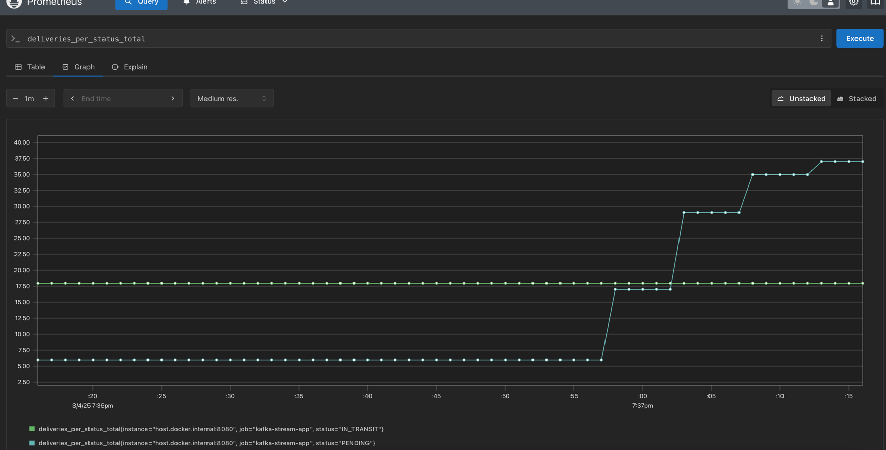
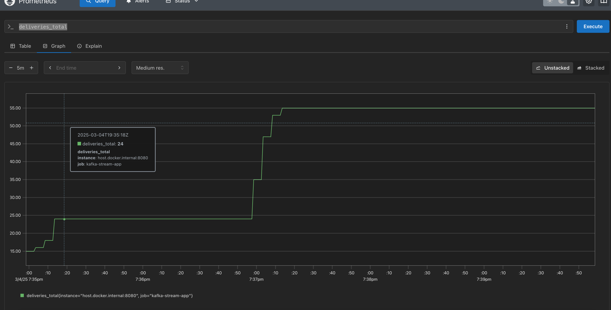

#  Scalable & Event-Driven Delivery Booking System

##  Overview
This project is a **high-performance, event-driven delivery booking system** designed with a **microservices architecture**. It efficiently **processes delivery bookings, assigns drivers, updates status, and streams analytics** for real-time monitoring.

---

## 🛠 Technologies Used

### **Backend:**
- **Spring Boot (WebFlux)** → Non-blocking, reactive architecture for high concurrency.
- **Spring Data R2DBC (PostgreSQL)** → Asynchronous database access to avoid blocking.
- **Spring Security (JWT)** → Secure API authentication.
- **Spring Cache (Redis)** → Enhances performance by caching frequently accessed data.
- **Spring Kafka (Producer & Streams)** → Asynchronous messaging & event-driven architecture.

### **Infrastructure & Performance:**
- **PostgreSQL** → Relational database with **Flyway** for schema versioning.
- **Redis (Redisson)** → Distributed **lock mechanism** to prevent race conditions.
- **Kafka (with Schema Registry)** → Event-driven communication & **stream processing**.
- **Grafana & Prometheus** → Real-time **monitoring & analytics**. (Prometheus part is done | grafana to do)
- **Docker & Docker Compose** → Containerized deployment for scalability.

---

## ️ System Architecture

### ** API Module (Spring Boot WebFlux)**
- Handles **Client, Driver, and Booking Management**.
- Uses **virtual threads** and **parallelism** to optimize performance.
- Assigns **available drivers** to bookings dynamically.
- Pushes **delivery status events** to **Kafka**.
- HATEOS links
### ** Kafka Producer Module**
- Publishes **status updates** (`PENDING → IN_TRANSIT → DELIVERED`) to **Kafka topics**.
- Uses **Avro schema** for **efficient serialization** & **type safety**.

### ** Kafka Streams Module**
- **Consumes booking status events**.
- **Computes & aggregates real-time metrics**:
 - **Total bookings**(done)
 - **Bookings per status**
 - **Average delivery time**(to do)
 - **Delayed deliveries**(to do)
- Streams results to **Kafka topics** for Grafana dashboards.

---

##  High-Performance Booking System: Handling Concurrency & Race Conditions

### ** Using Redis Distributed Lock**
- Prevents **multiple drivers from being assigned to the same booking**.
- Ensures **only one driver can be assigned per slot**.

### ** Virtual Threads & Parallelism**
- Uses **Java 21 virtual threads** for **massive scalability**.
- Parallel processing ensures **low latency booking assignments**.

### ** Efficient Resource Management**
- **Asynchronous DB calls** ensure **non-blocking** behavior.
- **Parallel driver selection & lock acquisition** ensure **optimal performance**.

---

##  Real-Time Monitoring & Analytics
1. **Kafka Streams computes real-time booking metrics.**
2. **Prometheus tracks system health & API performance.**
3. **Grafana visualizes:**
- **Live status updates**
- **Booking trends**
- **Delayed vs. on-time deliveries**

- 
---

## [IMPORTANT] Final Technical Summary 
The API design was optimized for simplicity and efficiency, with a primary focus on ensuring high availability and fairness in the booking system. The system is engineered to handle concurrent booking requests at scale, leveraging a thread-safe queue and Redis-based locking mechanisms to manage resource allocation. For instance, in a scenario with 200 simultaneous booking requests for a single delivery type and only 20 available drivers, the system efficiently processes these requests using virtual threads for parallelism, ensuring fair and rapid driver assignment.

Additionally, significant effort was dedicated to seamless integration of external systems into the core API architecture. The API interfaces with Redis, Kafka, and Prometheus with minimal latency and optimized connection overhead, ensuring robust performance and scalability. This design ensures reliable operation and efficient resource utilization across the entire system.


## ️ How to Run
### Prerequisites
- **Docker & Docker Compose**
- **Java 21**
- **Maven**

### ** Start Services**
```sh
docker-compose up -d or docker compose up 
mvn clean install -DskipTests | mvn spring-boot:run (for api module and kafa stream metrics module local run )

